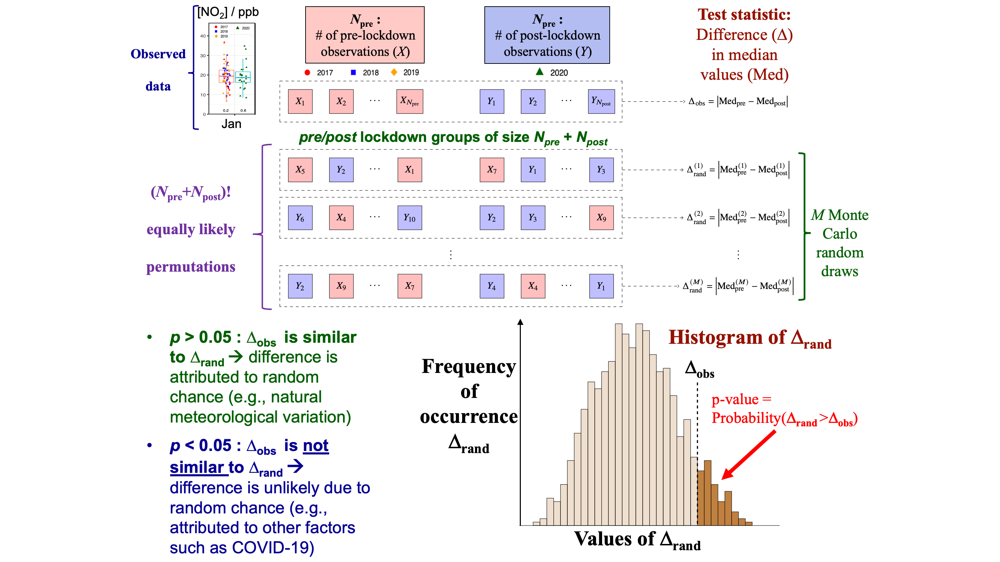

<!-- <\!-- equation numbering -\-> -->
<!-- <script type="text/x-mathjax-config"> -->
<!-- MathJax.Hub.Config({ -->
<!--   TeX: { equationNumbers: { autoNumber: "AMS" } } -->
<!-- }); -->
<!-- </script> -->

<!-- latex macros -->
\newcommand{\post}{\text{post}}
\newcommand{\pre}{\text{pre}}
\newcommand{\obs}{\text{obs}}
\newcommand{\rand}{\text{rand}}
\newcommand{\Npost}{N_{\post}}
\newcommand{\Npre}{N_{\pre}}
\newcommand{\var}{\operatorname{var}}

```{r setup, include = FALSE}
knitr::opts_chunk$set(
  collapse = TRUE,
  comment = "#>"
)
```

# Summary

This document shows how to obtain the pollutant data from the AQO website, convert it to the desired format, calculate p-values, and produce the corresponding plots in the paper by @alabadleh.etal21.

First let's load the R packages needed to perform all calculations.

```{r packages}
# load packages
require(aq2020)
require(tidyr)
require(dplyr)
require(rvest)
require(lubridate)
require(ggplot2)
```

# General Information about Stations and Pollutants

This will create a data frame with the following columns:

- `station`: The station name.
- `station_id`: The numeric station ID (for webscraping).
- `pollutant`: The pollutant name (`O3`, `PM25`, `NO2`, `CO`, `SO2`).
- `poll_id`: The numeric pollutant ID (for webscraping).
- `has_poll`: `TRUE/FALSE`, depending on whether the given station has records for the given pollutant.

This data frame has already been saved in the **aq2020** package and can be accessed as follows:

```{r pollutant_info}
pollutant_info
```

The following code shows how to calculate this data from scratch and save it as a CSV file.

**WARNING:** The dataset `pollutant_info` in the **aq2020** package may differ from a more recent webscrape version using the code below.  This is because the AQO periodically updates its station IDs.

```{r pollutant_info_calc, eval = FALSE}
# pollutant names and codes
pollutants <- c(O3 = 122, PM25 = 124, NO2 = 36, CO = 46, SO2 = 9)

# station names and ids
stations <- c(
  Barrie = 47045,
  Belleville = 54012,
  Brantford = 21005,
  Burlington = 44008,
  Brampton = 46090,
  Chatham = 13001,
  Cornwall = 56051,
  Grand_Bend = 15020,
  Guelph = 28028,
  Hamilton_Downtown = 29000,
  Hamilton_West = 29118,
  Hamilton_Mountain = 29214,
  Kingston = 52023,
  Kitchener = 26060,
  London = 15026,
  Milton = 44029,
  Mississauga = 46108,
  Newmarket = 48006,
  North_Bay = 75010,
  Oakville = 44017,
  Ottawa_Downtown = 51001,
  Oshawa = 45027,
  Parry_Sound = 49005,
  Peterborough = 59006,
  Port_Stanley = 16015,
  Sarnia = 14111,
  Sault_Ste_Marie = 71078,
  St_Catharines = 27067,
  Sudbury = 77233,
  Thunder_Bay = 63203,
  Toronto_Downtown = 31103,
  Toronto_East = 33003,
  Toronto_West = 35125,
  Windsor_Downtown = 12008,
  Windsor_West = 12016,
  Toronto_North = 34021
)

# keep only the combinations of stations and pollutants
# for which there is data on the AQO website
station_polls <- sapply(stations, function(station_id) {
  station <- "http://www.airqualityontario.com/history/station.php?stationid="
  station <- paste0(station, station_id)
  station <- read_html(station)
  station %>%
    html_node("#right_column table.resourceTable") %>%
    html_table(header = FALSE) %>%
    as_tibble() %>%
    filter(X1 == "Pollutants Measured:") %>%
    pull(X2)
})
statpoll_hasdata <- sapply(c("O3", "PM2[.]5", "NO2", "CO", "SO2"),
                           function(poll) {
  grepl(poll, station_polls)
})

# combine into a tibble
statpoll <- as_tibble(statpoll_hasdata) %>%
  mutate(station = names(stations),
         station_id = as.numeric(stations)) %>%
  pivot_longer(O3:SO2, names_to = "pollutant", values_to = "has_poll") %>%
  mutate(pollutant = gsub("\\[[.]\\]", "", pollutant),
         poll_id = as.numeric(pollutants[pollutant])) %>%
  select(station, station_id, pollutant, poll_id, has_poll)

# uncomment the line below to save this data as a CSV file
## write_csv(statpoll, path = "aq2020-pollutant_info.csv")
```

# Webscrape the Pollutant Data

For each station and pollutant combination for which there is data on the AQO website, the following code pulls this data from the website by year, with the option to pick only specific months.  Here we'll take all available data from 2017-2020.

The first step is to save each webscrape as a file of the form `Barrie_NO2_2020_1_12.rds`.  This is a compressed format consisting here of the `NO2` data from the Barrie station for 2020, for months January through December.

**Warning:** The webscraping below may not provide the same results as those saved in the **aq2020** package.  This is because the AQO periodically updates the data on its website.

```{r webscrape_initial_setup}
# where to save raw queries
data_path <- file.path("data", "pollutant", "raw")

#' Helper function to standardize file names.
#'
#' @param path Path to the file.
#' @param ... Elements of the file name, to be concatenated into a single string separated by "_".
#' @param ext File extension.
#' @return A string representing the file name.
get_filename <- function(path, ..., ext = "rds") {
  fname <- paste0(c(...), collapse = "_")
  file.path(path, paste0(fname, ".", ext))
}

# setup webscrape query information
query_dates <- tibble(
  year = 2017:2020,
  start_month = 1,
  end_month = 12
)
# combine with station/pollutant information
query_info <- pollutant_info %>%
  filter(has_poll) %>% # keep only stat/poll combo for which there is data
  mutate(by = rep(1, n())) %>%
  full_join(query_dates %>%
            mutate(by = rep(1, n()))) %>%
  select(year, start_month, end_month,
         station, station_id, pollutant, poll_id)
nquery <- nrow(query_info)

#' Helper function for webscraping.
#'
#' @details Helper function to:
#'
#' - Webscrape a query (given station/pollutant/year).
#' - Format consistently (see [aq2020::get_aqoyr()]).
#' - Save as `data_path/station_pollutant_year_startmonth_endmonth.rds`
#'
#' The webscrape query fails, it saves the file with the content `NA`.
#'
#' @param query Webscrape specification.  A list with elements `station`, `pollutant`, `year`, `station_id` ,`poll_id`, `start_month`, `end_month`.
get_query <- function(query) {
  message("Station: ", query$station,
          ", Pollutant: ", query$pollutant,
          ", Year: ", query$year)
  query_yr <- tryCatch(
    get_aqoyr(station_id = query$station_id,
              poll_id = query$poll_id,
              year = query$year,
              start_month = query$start_month,
              end_month = query$end_month,
              fill = TRUE),
    error = function(e) NA)
  # save data
  saveRDS(query_yr,
          file = get_filename(path = data_path,
                              query$station, query$pollutant,
                              query$year, query$start_month, query$end_month))
}

# number of seconds to wait between website scrapes
wait_time <- c(min = .5, max = 1)

# query subset
# in this case, we just need 2020 as the other years
# were saved in a previous run
sub_query <- which(query_info$year < 2020)
```

```{r true_path, include = FALSE}
data_path <- system.file("extdata", "data", "pollutant", "raw",
                         package = "aq2020")
```

```{r webscrape_initial_run, eval = FALSE}
system.time({
  for(ii in sub_query) {
    query <- query_info[ii,]
    get_query(query)
    # wait between queries for a random amount of time
    Sys.sleep(runif(1, min = wait_time["min"], max = wait_time["max"]))
  }
})
```

## Testing

Now let's check that all stations and pollutant datasets have been successfully queried for years 2017-2020:

```{r webscrape_check_years}
# check if we have all yearly datasets
sub_query <- which(query_info$year %in% 2017:2020)
bad_ind <- sapply(sub_query, function(ii) {
  query <- query_info[ii,]
  query_yr <- readRDS(get_filename(path = data_path,
                                   query$station, query$pollutant,
                                   query$year, query$start_month,
                                   query$end_month))
  all(is.na(query_yr))
})

query_info[sub_query[bad_ind],] %>% print(n = Inf)
```

We can see that the webscrape failed in a few years for a few of the station/pollutant combinations.  We can manually check the AQO website to see what's going on.  So for example, to see what happend in Milton for O3 in 2017, take the following URL:

```
http://www.airqualityontario.com/history/index.php?c=Academic&s={station_id}&y={year}&p={poll_id}&m={start_month}&e={end_month}&t=html&submitter=Search&i=1
```

and replace the following terms:

- `{station_id}`: The station ID for Milton, which is 44029.
- `{year}`: The year in question, which in this case is 2017.
- `{poll_id}`: The pollutant ID, which in this case is 122.
- `{start_month}`: The start month as a number, which is 1 (January).
- `{end_month}`: The end month as a number, which is 12 (December).

So the URL above becomes:

```
http://www.airqualityontario.com/history/index.php?c=Academic&s=44029&y=2017&p=122&m=1&e=12&t=html&submitter=Search&i=1
```

At the time of this writing, following this URL above produces the message:

```
Sorry no results found for Ozone at Milton(44029) between January and December of the year 2017.
```


# Process the Raw Data

A raw data file from the webscrape looks like this:

```{r webscrape_display}
query <- query_info[1,] # look at the first query
query_yr <- readRDS(get_filename(path = data_path,
                                 query$station, query$pollutant,
                                 query$year, query$start_month,
                                 query$end_month))
# display
message("Station: ", query$station,
        ", Pollutant: ", query$pollutant,
        ", Year: ", query$year)
as_tibble(query_yr)
```

Cleaning the raw concentration data involves the following steps:

- Replacing erronous hourly concentration values of `-999` or `9999` by `NA`.
- Convert hourly concentrations to daily averages.
- Combine all stations/pollutants into a single data frame.
- Keep only columns `Date`, `Station`, `Pollutant`, and `Concentration`.

The result of these processing steps are available in the **aq2020** package in the `pollutant_data` object:

````{r pollutant_data}
pollutant_data
````

<!-- **Warning:** The 2019 and 2020 data are slightly different now (Jan 23, 2021) from what they were when last scraped (July 7, 2020).  The original data are save in the folder `/Users/mlysy/Documents/proj/chemODE/covid/data/raw`. -->

Here is how to recreate this object from scratch:

```{r pollutant_data_calc, eval = FALSE}
# merge webscrape files
pollutant_data <- lapply(which(!bad_ind), function(ii) {
  query <- query_info[ii,]
  readRDS(get_filename(path = data_path,
                       query$station, query$pollutant,
                       query$year, query$start_month,
                       query$end_month)) %>%
    as_tibble() %>%
    mutate(Station = query$station,
           Pollutant = query$pollutant) %>%
    select(Date, Station, Pollutant, H01:H24)
}) %>% bind_rows()

# process
pollutant_data <- pollutant_data %>%
  mutate(Date = ymd(Date)) %>%
  mutate_at(vars(H01:H24), .funs = ~na_if(., 9999)) %>%
  mutate_at(vars(H01:H24), .funs = ~na_if(., -999)) %>%
  pivot_longer(cols = H01:H24, names_to = "Hour",
               values_to = "Concentration") %>%
  group_by(Date, Station, Pollutant) %>%
  summarize(Concentration = mean(Concentration, na.rm = TRUE),
            .groups = "drop")
rownames(pollutant_data) <- NULL
```

# P-value Calculation

```{r pvalex_setup, include = FALSE}
pv_month <- "June"
pv_station <- "Toronto West"
```

Figure \@ref(fig:pvalex) plots the daily $\text{NO}_2$ concentration in `r pv_station` over weekdays in `r pv_month` 2020, and during reference years 2017-2019.

```{r pvalex, fig.width = 7, fig.height = 3.5, out.width = "100%", fig.cap = paste0("Daily $\\text{NO}_2$ pollutant concentrations in", pv_station, " (weekdays only) during ", pv_month, " 2020 and ", pv_month, " 2017-2019.")}
poll_data <- pollutant_data %>%
  # keep only dates in question
  filter(
    Station == "Toronto_West",
    Pollutant == "NO2",
    month(Date, label = TRUE, abbr = FALSE) == "June",
    !wday(Date, label = TRUE) %in% c("Sat", "Sun"), # remove weekends
    !is.na(Concentration) # remove missing values
  ) %>%
  mutate(
    # identifier for year
    Year = as.character(year(Date)),
    # identifier for 2020 or reference years
    Period = ifelse(Year == "2020", "2020", "2017-2019"),
  )

# plot data
poll_data %>%
  ggplot(aes(x = Period, y = Concentration)) +
  geom_boxplot(aes(color = Period),
               outlier.shape = NA, alpha = .25) + 
  geom_jitter(aes(fill = Year), width = .2, size = 2, shape = 21) +
  ylab(expression(NO[2]*" Concentration "*(ppb))) + 
  theme_bw()

# calculate median in each group
poll_med <- poll_data %>%
  group_by(Period) %>%
  summarize(Median_Concentration = median(Concentration))
poll_med
```

```{r pvalex_med, include =FALSE}
med_post <- poll_med %>%
  filter(Period == "2020") %>%
  pull(Median_Concentration) %>% round(1)
med_pre <- poll_med %>%
  filter(Period != "2020") %>%
  pull(Median_Concentration) %>% round(1)
```

The data indicate that the median weekday $\text{NO}_2$ concentration in `r pv_month` during the reference years 2017-2019 was `r med_pre` ppb, whereas the median concentration in `r pv_month` 2020 was only `r med_post` ppb.  Does this mean that the drop in $\text{NO}_2$ is due to the provincial lockdown imposed mid-March?  Not necessarily, since this drop could simply be due to natural meteorological fluctuations from one year to the next.  The statistical methodology in @alabadleh.etal21 aims to quantify the probability that this drop is simply due to "random chance" as follows:

1.  Suppose that the $\Npost$ post-lockdown concentration values in `r pv_month` 2020 are labeled $Y_1, \ldots, Y_{\Npost}$, and the $\Npre$ pre-lockdown concentration values in the reference data `r pv_month` 2017-2019 are labeled $X_1, \ldots, X_{\Npre}$. 

2.  Let

    $$
	\Delta_{\obs} = \left\vert\text{Median}_{\pre} - \text{Median}_{\post} \right\vert
	$$
	
	denote the absolute median difference observed between pre- and post-lockdown data; in this case, $|`r med_pre` - `r med_post`| = `r abs(med_pre - med_post)`$.
	
3.  Under the null hypothesis $H_0$ that there is no pre/post lockdown difference, every permutation of the $N_{\pre} + N_{\post}$ observations into groups of size $N_{\pre}$ and $N_{\post}$ is equally likely.

4.  In order to assess whether $\Delta_{\obs} = `r abs(med_pre - med_post)`$ is statistically significant @alabadleh.etal21 proposes to calculate the randomization p-value

	\begin{equation}
	p = \Pr(\Delta_{\rand} > \Delta_{\obs}),
	(\#eq:prand)
	\end{equation}
	
	where $\Delta_{\rand}$ is the absolute difference in medians for a random permutation of the observed data.
	
5.  In principle, the randomization p-value \@ref(eq:prand) can be calculated exactly by enumerating all $(N_{\pre} + N_{\post})!$ permutations of the data.  However, this is typically a very large number, rendering such an approach inviable in practice.  Instead, \@ref(eq:prand) is estimated to arbitrarily high precision by Monte Carlo simulation, by reporting the fraction of times $\Delta_{\rand}$ exceeds $\Delta_{\obs}$ on a large number $M$ of randomly drawn permutations.  A classical result  for binomial sampling is that the Monte Carlo standard error for $M$ random permutations is no more than $1/\sqrt{4M}$.  Thus with $M = 10000$, the Monte Carlo standard error on the p-value calculation is no more than $0.005$.

The procedure above is illustrated in Figure \@ref(fig:pvalcartoon).  As indicated in the Figure, a p-value $p > 0.05$ indicates that $\Delta_{\obs}$ is similar to $\Delta_{\rand}$, and therefore the observed difference in medians can potentially be attributed to random chance.  When $p < 0.05$, the observed difference in medians is much larger than what would be expected by random chance, suggesting that it could be explained by other factors such as the lockdown effect.

```{r pvalcartoon, echo = FALSE, fig.cap = "Graphical illustration of the randomization test.", out.width = "100%"}

```

The **aq2020** package provides the function `fisher_pv()` to calculate randomization p-values.  As explained in the documentation, `fisher_pv()` takes the following inputs:

- `value`: A vector of length $N_{\pre} + N_{\post}$ of daily median data.

- `group`: A grouping vector of length $N_{\pre} + N_{\post}$ indicating whether the elements of `value` belong to pre- or post-lockdown data.  Any vector for which `length(unique(group)) == 2` is an appropriate grouping vector, e.g., consisting of integers 1 and 2, a two-level factor, etc.

- `Tfun`: A function taking arguments `value` and `group` which returns the absolute difference in medians between groups.  This function is passed to `fisher_pv()` for greater generality, in case the user wishes to specify a test statistic other than difference in medians.

- `nsim`: The number of permutations to randomly select in order to approximate \@ref(eq:prand).

The calculation of the randomization test p-value for `r pv_station` `r pv_month` 2020 vs `r pv_month` 2017-2019 is presented below.

```{r pvalex_medcalc}
# Calculate difference in medians statistic.
med_diff <- function(value, group) {
  if(length(unique(group)) != 2) {
    stop("group must consist of exactly 2 unique groups.")
  }
  meds <- tapply(value, group, median)
  dmeds <- abs(meds[1] - meds[2])
  setNames(dmeds, nm = "med_diff")
}

# compute the randomization test p-value
diff_pv <- fisher_pv(value = poll_data$Concentration,
                     group = poll_data$Period,
                     Tfun = med_diff,
                     nsim = 1000)
diff_pv
```

The first element of `diff_pv` is the difference in medians statistic, $\Delta_{\obs} = `r round(diff_pv[1], 1)`$.  The second element is the (Monte Carlo estimate of the) randomization test p-value, which in this case is $p = `r diff_pv[2]`$.  Thus, the drop in median $\text{NO}_2$ concentration of $`r round(diff_pv[1], 1)`$ ppb in `r pv_month` 2020 compared to pre-lockdown reference data of `r pv_month` 2017-2019 is not statistically significant at the 5% level.

## Comparison of Reference Years

The statistical method outlined above tests the null hypothesis that there is no difference between pre- and post-lockdown data in a given month.  However, the randomization testing framework can also be used to test for differences between more than two groups.  Of particular interest here is whether the `r pv_month` data in each of the three years 2017-2019 are indeed similar enough to be grouped together into a common reference set.  The procedure is similar to the two-group case:

1.  Suppose there are $N_{2017}$, $N_{2018}$ and $N_{2019}$ daily medians (no weekends) in each of the reference years.

2.  Consider any test statistic on the data in these years which could be used to assess whether the three years are similar.  For example:

	- The range statistic
	
	    $$
		R_{\obs} = \max\{\text{Median}_{2017}, \text{Median}_{2018}, \text{Median}_{2019}\} - \min\{\text{Median}_{2017}, \text{Median}_{2018}, \text{Median}_{2019}\}.
	    $$
		
	- The variance statistic
	
		$$
		V_{\obs} = \var\{\text{Median}_{2017}, \text{Median}_{2018}, \text{Median}_{2019}\}.
		$$

	In @alabadleh.etal21, the range statistic $R_{\obs}$ is used, since (i) reduces to the absolute difference in medians when there are only two groups and (ii) the variance is rarely computed from only three elements.  However, with more than three groups $V_{\obs}$ may have its merits over $R_{\obs}$.
	
3.  The randomization p-value is defined as

	\begin{equation}
	p = \Pr(R_{\rand} > R_{\obs}),
	(\#eq:prandmulti)
	\end{equation}
	
	where $R_{\rand}$ is the range statistic for a random permutation of the $N_{2017} + N_{2018} + N_{2019}$ observations to three groups of size $N_{2017}$, $N_{2018}$, and $N_{2019}$.

The reference year p-value is computed for the `r pv_month` 2017-2019 data below.

```{r pvalex_rngcalc}
# Calculate range between group medians statistics.
med_range <- function(value, group) {
  if(length(unique(group)) <= 1) {
    stop("group must consist of at least two unique groups.")
  }
  meds <- tapply(value, group, median)
  rmeds <- max(meds) - min(meds)
  setNames(rmeds, nm = "med_range")
}


# create a dataset with only the 2017-2019 data and group = year
poll_data2 <- poll_data %>%
  filter(Period == "2017-2019") %>%
  mutate(Year = year(Date))

# compute the randomization test p-value
range_pv <- fisher_pv(value = poll_data2$Concentration,
                      group = poll_data2$Year,
                      Tfun = med_range,
                      nsim = 1000)
range_pv
```

Thus we see that the randomization p-value for `r pv_month` during 2017-2019 is $p = `r range_pv[2]`$, which is not statistically significant.  Therefore, we cannot reject the null hypothesis that the median concentration during these years is similar, which justifies grouping them together as reference years.

## Multiple P-value Calculations

The randomization test p-value proposed by @alabadleh.etal21 is useful for estabilishing statistical significance of differences in air quality measures under minimal modeling assumptions.  However, the computation of the p-value can be time-consumming for each of numerous pollutants, stations, years, months, etc.

In a separate vignette, we provide a detailed example of computing these p-values on multiple cores in parallel (e.g., over a server).  To see the code, run the command `vignettes("aq2020-pvalue")`.  The full set of p-values for the concentration data is provided by **aq2020** in the `pollutant_pval` dataset:

```{r pollutant_pval}
pollutant_pval
```

The columns in the dataset are:

- `Station`: Station name.
- `Pollutant`: Pollutant name.
- `Period`: 2017-2019 or 2020.
- `Month`: Name of the month.
- `Ndays`: Number of days in the given Month and Period.
- `Median`: Median concentration over all days in the given Month and Period.
- `Pval`: P-value of the randomization test.


# Plotting

The p-values can be added to Figure \@ref(fig:pvalex) as follows:

```{r pvalexpv, fig.width = 7, fig.height = 3.5, out.width = "100%", fig.cap = "Daily $\\text{NO}_2$ pollutant concentrations with p-values."}
# format the p-value data for ggplot
pval_data <- tibble(Pvalue = c(diff_pv[2], range_pv[2]),
                    Period = c("2017-2019", "2020"))

poll_data %>%
  ggplot(aes(x = Period, y = Concentration), ylim = c(0, Inf)) +
  geom_boxplot(aes(color = Period),
               outlier.shape = NA, alpha = .25) + 
  geom_jitter(aes(fill = Year), width = .2, size = 2, shape = 21) +
  # p-value labels at bottom of boxplots
  geom_text(data = pval_data,
            mapping = aes(x = Period, label = Pvalue, y = 2)) + 
  ylab(expression(NO[2]*" Concentration "*(ppb))) + 
  theme_bw()
```

One can also plot multiple p-values across different stations and different months.  For this we'll use the precomputed datasets `pollutant_data` and `pollutant_pval`.  

```{r pvalexmulti, fig.width = 7, fig.height = 7, out.width = "100%", fig.cap = "Daily $\\text{NO}_2$ pollutant concentrations with p-values for multiple months and stations."}
poll_data <- pollutant_data %>%
  filter(
    Pollutant == "NO2",
    Station %in% c("Grand_Bend", "Kitchener", "Toronto_West"),
    month(Date) %in% 1:6,
    !wday(Date, label = TRUE) %in% c("Sat", "Sun"), # remove weekends
    !is.na(Concentration)
  ) %>%
  mutate(
    Year = factor(year(Date)),
    Month = month(Date, label = TRUE, abbr = FALSE),
    Period = ifelse(Year == "2020", "2020", "2017-2019")
  )

pval_data <- pollutant_pval %>%
  filter(
    Pollutant == "NO2",
    Station %in% c("Grand_Bend", "Kitchener", "Toronto_West"),
    as.numeric(Month) %in% 1:6
  )

poll_data %>%
  ggplot(aes(x = Month, y = Concentration), ylim = c(-5, Inf)) +
  geom_boxplot(aes(color = Period),
               outlier.shape = NA, alpha = .25) + 
  geom_jitter(mapping = aes(fill = Year, group = Period),
              position = position_jitterdodge(0.7, seed = 1),
              size = .8, shape = 21, color = "transparent") +
  # p-value labels at bottom of boxplots
  geom_text(data = pval_data,
            mapping = aes(x = Month, label = round(Pval, 2),
                          group = Period, y = -2),
            position = position_dodge(0.8), size = 3) + 
  facet_wrap(~ Station, nrow = 3, scales = "free_y") +
  ylab(expression(NO[2]*" Concentration "*(ppb))) + 
  theme_bw()
```

# References

